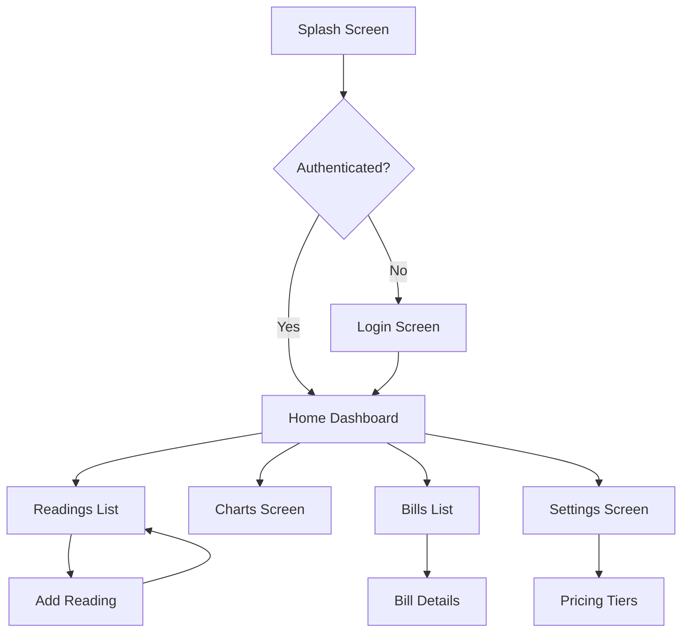
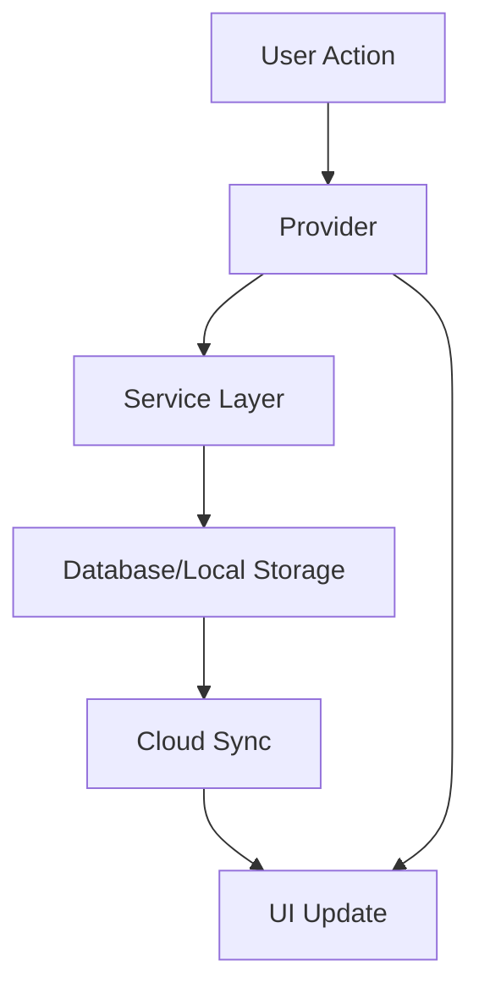
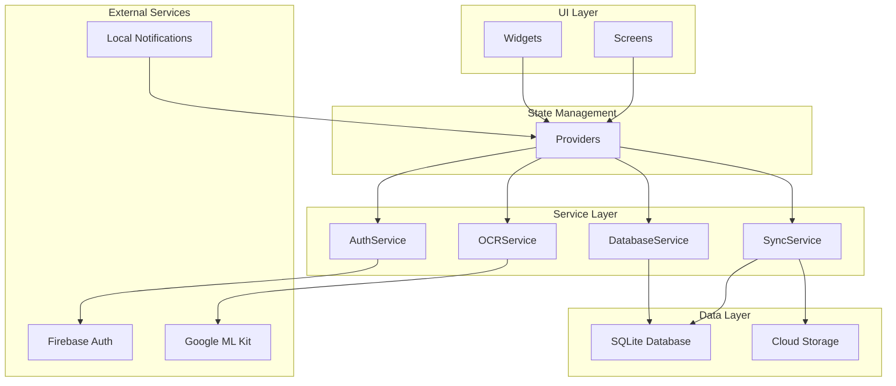

# Electricity Consumption Monitoring App - Architecture Design

## Overview
This document outlines the comprehensive architecture for a Flutter-based electricity consumption monitoring app. The app enables users to track meter readings, calculate bills, visualize consumption patterns, and manage settings with offline capabilities and cloud synchronization.

## Core Features
- User authentication and profile management
- Manual and OCR-based meter reading input
- Real-time consumption dashboard
- Historical data visualization with charts
- Automated bill calculation based on pricing tiers
- Offline data storage with cloud synchronization
- Push notifications for usage alerts and bill reminders
- Cross-platform support (iOS, Android, Web)

## Screen Specifications

### 1. Splash Screen
- Displays app logo and loading indicator
- Checks authentication status
- Redirects to login or home screen

### 2. Authentication Screens
- **Login Screen**: Email/password input, forgot password link
- **Signup Screen**: Registration form with validation
- **Forgot Password Screen**: Email input for password reset

### 3. Home Dashboard
- Summary cards: Current usage, estimated bill, alerts
- Quick action buttons: Add reading, view charts
- Recent readings list preview
- Navigation to other sections

### 4. Readings Management
- **Readings List Screen**: Paginated list of all readings with search/filter
- **Add Reading Screen**: Manual input form or camera interface for OCR
- **Reading Details Screen**: View/edit individual reading

### 5. Charts and Analytics
- Consumption trends over time (line/bar charts)
- Usage comparison by period
- Peak usage analysis
- Export functionality

### 6. Bills Management
- **Bills List Screen**: Historical bills with payment status
- **Bill Details Screen**: Breakdown of charges, payment options
- **Bill Generation**: Automatic monthly bill creation

### 7. Settings Screen
- User profile management
- Pricing tier configuration
- Notification preferences
- App theme and language settings
- Data export/import options

## Navigation Flow



## Data Models

### User
```dart
class User {
  final String id;
  final String email;
  final String name;
  final String passwordHash;
  final DateTime createdAt;
  final Map<String, dynamic> settings;
}
```

### MeterReading
```dart
class MeterReading {
  final String id;
  final String userId;
  final double readingValue;
  final DateTime date;
  final String? photoPath;
  final bool isManual;
  final double consumption;
}
```

### PricingTier
```dart
class PricingTier {
  final String id;
  final String userId;
  final String name;
  final double ratePerUnit;
  final DateTime startDate;
  final DateTime endDate;
}
```

### Bill
```dart
class Bill {
  final String id;
  final String userId;
  final DateTime startDate;
  final DateTime endDate;
  final double totalUnits;
  final double totalAmount;
  final String status; // 'paid', 'unpaid', 'overdue'
  final DateTime generatedAt;
}
```

### Notification
```dart
class Notification {
  final String id;
  final String userId;
  final String type; // 'high_usage', 'bill_due', 'system'
  final String message;
  final DateTime date;
  final bool isRead;
}
```

### AppSettings
```dart
class AppSettings {
  final String id;
  final String userId;
  final String theme;
  final bool notificationEnabled;
  final bool autoBackup;
}
```

## Services Architecture

### DatabaseService
- Handles all CRUD operations for local SQLite database
- Implements data encryption using SQLCipher
- Manages database migrations and schema updates

### AuthService
- Manages user authentication (login/signup/logout)
- Integrates with Firebase Authentication
- Handles password reset and account management

### NotificationService
- Schedules local notifications using flutter_local_notifications
- Manages notification preferences and history
- Integrates with Firebase Cloud Messaging for push notifications

### OCRService
- Processes meter photos using Google ML Kit
- Extracts numerical values from images
- Validates OCR results and handles errors

### SyncService
- Monitors network connectivity
- Synchronizes local data with cloud storage
- Handles conflict resolution for offline changes

### BackupService
- Performs periodic data backups to cloud
- Manages backup scheduling and restoration
- Ensures data integrity during backup operations

## Database Schema

### Tables Structure
```sql
-- Users table
CREATE TABLE users (
    id TEXT PRIMARY KEY,
    email TEXT UNIQUE NOT NULL,
    name TEXT NOT NULL,
    password_hash TEXT NOT NULL,
    created_at DATETIME DEFAULT CURRENT_TIMESTAMP,
    settings TEXT -- JSON string
);

-- Meter readings table
CREATE TABLE meter_readings (
    id TEXT PRIMARY KEY,
    user_id TEXT NOT NULL,
    reading_value REAL NOT NULL,
    date DATETIME NOT NULL,
    photo_path TEXT,
    is_manual BOOLEAN DEFAULT 1,
    consumption REAL,
    FOREIGN KEY (user_id) REFERENCES users(id)
);

-- Pricing tiers table
CREATE TABLE pricing_tiers (
    id TEXT PRIMARY KEY,
    user_id TEXT NOT NULL,
    name TEXT NOT NULL,
    rate_per_unit REAL NOT NULL,
    start_date DATETIME NOT NULL,
    end_date DATETIME,
    FOREIGN KEY (user_id) REFERENCES users(id)
);

-- Bills table
CREATE TABLE bills (
    id TEXT PRIMARY KEY,
    user_id TEXT NOT NULL,
    start_date DATETIME NOT NULL,
    end_date DATETIME NOT NULL,
    total_units REAL NOT NULL,
    total_amount REAL NOT NULL,
    status TEXT DEFAULT 'unpaid',
    generated_at DATETIME DEFAULT CURRENT_TIMESTAMP,
    FOREIGN KEY (user_id) REFERENCES users(id)
);

-- Notifications table
CREATE TABLE notifications (
    id TEXT PRIMARY KEY,
    user_id TEXT NOT NULL,
    type TEXT NOT NULL,
    message TEXT NOT NULL,
    date DATETIME DEFAULT CURRENT_TIMESTAMP,
    is_read BOOLEAN DEFAULT 0,
    FOREIGN KEY (user_id) REFERENCES users(id)
);

-- App settings table
CREATE TABLE app_settings (
    id TEXT PRIMARY KEY,
    user_id TEXT NOT NULL,
    theme TEXT DEFAULT 'light',
    notification_enabled BOOLEAN DEFAULT 1,
    auto_backup BOOLEAN DEFAULT 1,
    FOREIGN KEY (user_id) REFERENCES users(id)
);
```

### Encryption Implementation
- Database encryption using SQLCipher
- Encryption key derived from user password + device-specific salt
- Sensitive data (passwords, personal info) encrypted at rest
- Key management using Flutter Secure Storage

## State Management

### Provider Pattern Implementation
- **AuthProvider**: Manages authentication state and user session
- **ReadingsProvider**: Handles meter readings data and operations
- **BillsProvider**: Manages bill calculations and history
- **SettingsProvider**: Controls app settings and preferences
- **SyncProvider**: Manages offline/online synchronization status

### State Flow


## Integration Points

### Offline Synchronization
- **Connectivity Monitoring**: Uses connectivity_plus package
- **Background Sync**: WorkManager for periodic synchronization
- **Conflict Resolution**: Last-write-wins with user confirmation for conflicts
- **Queue Management**: Pending operations stored locally until network available

### Cloud Backup
- **Firebase Integration**: Firestore for data storage, Storage for photos
- **Automatic Backup**: Scheduled backups based on user preferences
- **Data Encryption**: End-to-end encryption for cloud-stored data
- **Backup Verification**: Integrity checks and recovery options

### Cross-Platform Considerations
- **Platform-Specific Features**:
  - iOS: Keychain for secure storage, APNs for notifications
  - Android: Android Keystore, FCM for notifications
  - Web: LocalStorage with encryption, Service Workers for background sync
- **Responsive Design**: Adaptive layouts for different screen sizes
- **Platform Channels**: Native code integration for device-specific features
- **Plugin Compatibility**: Careful selection of cross-platform plugins

## Component Interaction Overview



## Security Considerations
- Data encryption at rest and in transit
- Secure authentication with biometric support
- Input validation and sanitization
- Rate limiting for API calls
- Secure key management
- Privacy compliance (GDPR/CCPA)

## Performance Optimizations
- Lazy loading for large datasets
- Image compression for meter photos
- Background processing for heavy computations
- Caching strategies for frequently accessed data
- Optimized database queries with indexes

## Testing Strategy
- Unit tests for services and utilities
- Widget tests for UI components
- Integration tests for end-to-end flows
- Performance testing for large datasets
- Security testing for encryption and authentication

## Deployment and Maintenance
- CI/CD pipeline with automated testing
- Code signing and security scanning
- Over-the-air updates for bug fixes
- Monitoring and analytics integration
- User feedback collection system

This architecture provides a scalable, secure, and maintainable foundation for the electricity consumption monitoring app, with comprehensive offline capabilities and cross-platform support.